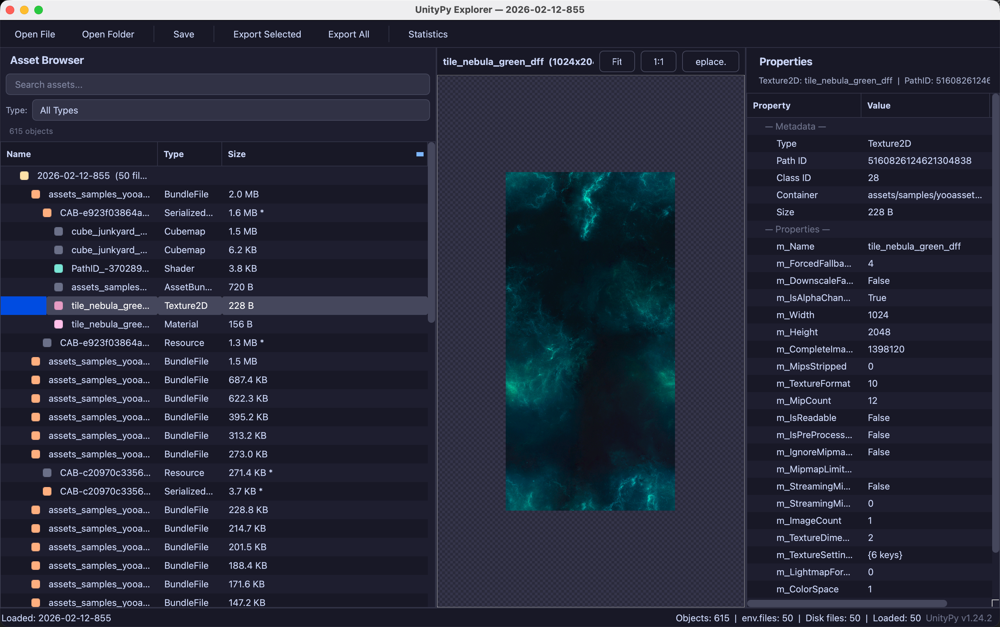

# UnityPy Explorer — GUI Application

> Built with [Cursor](https://www.cursor.com/) + Claude Opus 4.6 (Anthropic)



---

## English

### Overview

UnityPy Explorer is a cross-platform desktop GUI for browsing, previewing, and exporting Unity game assets. It is built on top of [UnityPy](https://github.com/K0lb3/UnityPy) and powered by PySide6 (Qt for Python), featuring a modern dark theme inspired by Catppuccin Mocha.

### Features

#### File Operations

- **Open File** (`Ctrl+O`) — Load a single Unity asset file (`.unity3d`, `.assets`, `.bundle`, `.apk`, `.zip`)
- **Open Folder** (`Ctrl+Shift+O`) — Recursively load all Unity files in a directory
- **Save / Save As** (`Ctrl+S` / `Ctrl+Shift+S`) — Save modifications back to the original or a new file
- **Recent Files** — Quick access to the last 10 opened files
- **Drag & Drop** — Drop files or folders anywhere onto the window to load them

#### Asset Browser

- Hierarchical tree view organized by file structure (BundleFile → SerializedFile → Objects)
- Three sortable columns: **Name**, **Type**, **Size**
- **Real-time search** (`Ctrl+F`) with case-insensitive name matching
- **Type filter** dropdown — filter by any asset type (Texture2D, AudioClip, Mesh, etc.)
- Color-coded type icons for quick visual identification
- Right-click context menu: Export, Replace, Copy Name / Type / Size / Path ID / Container Path

#### Preview Panel

| Asset Type | Preview |
|---|---|
| **Texture2D / Sprite / Texture2DArray** | Image viewer with zoom (scroll wheel), pan (drag), Fit / 1:1 buttons, checkerboard transparency background |
| **AudioClip** | Built-in audio player with Play / Pause / Stop and elapsed time display |
| **TextAsset** | Syntax-highlighted text editor with line numbers, editable with Apply button |
| **Shader** | Decompiled shader source code view |
| **MonoBehaviour / AnimationClip / Material / GameObject** | Formatted JSON tree view |
| **Mesh** | Info display (vertex count, submeshes, bind poses) |
| **Font** | Info display (format, size, data size) |
| **Other types** | Hex dump viewer (first 16 KB) |

#### Property Inspector

- Displays all metadata (Type, Path ID, Class ID, Container, Size)
- Recursive property tree with expandable nested structures
- Context menu to copy values or property names
- Depth limit (10 levels) and list limit (200 items) for safety

#### Export

- **Export Selected** (`Ctrl+E`) — Export all visible / filtered objects
- **Export All** (`Ctrl+Shift+E`) — Export every object in the environment
- Options: preserve container paths, export unknown types as raw binary
- Progress dialog with cancel support
- Automatic format selection:

| Type | Format |
|---|---|
| Texture2D / Sprite | `.png` |
| AudioClip | `.wav` / `.ogg` (original) |
| TextAsset | `.txt` / `.json` / `.xml` |
| Mesh | `.obj` |
| Shader | `.shader` |
| Font | `.ttf` / `.otf` |
| MonoBehaviour | `.json` |
| Unknown | `.bin` |

#### Asset Modification

- **Replace Texture** — Replace Texture2D / Sprite with a new image via right-click or toolbar
- **Edit Text** — Edit TextAsset content directly in the preview panel and apply changes
- **Save** — Write modifications back to the Unity asset file

#### Statistics

- `Tools → Statistics...` — View total object count, total size, unique types, file count, and a sortable type breakdown table

### Keyboard Shortcuts

| Shortcut | Action |
|---|---|
| `Ctrl+O` | Open File |
| `Ctrl+Shift+O` | Open Folder |
| `Ctrl+S` | Save |
| `Ctrl+Shift+S` | Save As |
| `Ctrl+W` | Close File |
| `Ctrl+F` | Search Assets |
| `Ctrl+E` | Export Selected |
| `Ctrl+Shift+E` | Export All |
| `Ctrl+Q` | Quit |

### Build

```bash
# macOS Apple Silicon
python build_app.py --target mac-arm64

# macOS Intel
python build_app.py --target mac-intel

# Windows 64-bit
python build_app.py --target win64

# Or use the helper scripts
./build_app.sh arm64          # macOS
build_app.bat 64              # Windows
```

Output: `dist/UnityPy Explorer-<target>.app` (macOS) or `dist/UnityPyExplorer-<target>/UnityPyExplorer.exe` (Windows)

### Requirements

- Python 3.8+
- PySide6 >= 6.5.0
- Pillow >= 9.0.0
- UnityPy >= 1.20.0

---

## 中文

### 概述

UnityPy Explorer 是一个跨平台的桌面 GUI 应用，用于浏览、预览和导出 Unity 游戏资源。它基于 [UnityPy](https://github.com/K0lb3/UnityPy) 构建，使用 PySide6 (Qt for Python) 开发，采用 Catppuccin Mocha 风格的现代暗色主题。

### 功能特性

#### 文件操作

- **打开文件** (`Ctrl+O`) — 加载单个 Unity 资源文件（`.unity3d`、`.assets`、`.bundle`、`.apk`、`.zip`）
- **打开文件夹** (`Ctrl+Shift+O`) — 递归加载目录中所有 Unity 文件
- **保存 / 另存为** (`Ctrl+S` / `Ctrl+Shift+S`) — 将修改保存到原文件或新文件
- **最近文件** — 快速访问最近打开的 10 个文件
- **拖放** — 将文件或文件夹拖放到窗口任意位置即可加载

#### 资源浏览器

- 按文件结构分层显示的树形视图（BundleFile → SerializedFile → Objects）
- 三列可排序：**名称**、**类型**、**大小**
- **实时搜索** (`Ctrl+F`)，不区分大小写
- **类型筛选** 下拉框 — 按任意资源类型过滤（Texture2D、AudioClip、Mesh 等）
- 按类型着色的图标，便于快速识别
- 右键菜单：导出、替换、复制名称 / 类型 / 大小 / Path ID / Container 路径

#### 预览面板

| 资源类型 | 预览方式 |
|---|---|
| **Texture2D / Sprite / Texture2DArray** | 图片查看器，支持滚轮缩放、拖拽平移、适应窗口 / 1:1 按钮、棋盘格透明背景 |
| **AudioClip** | 内置音频播放器，支持播放 / 暂停 / 停止，显示播放时间 |
| **TextAsset** | 带行号的文本编辑器，可编辑并应用更改 |
| **Shader** | 反编译后的着色器源码查看 |
| **MonoBehaviour / AnimationClip / Material / GameObject** | 格式化的 JSON 树形视图 |
| **Mesh** | 信息展示（顶点数、子网格、绑定姿势） |
| **Font** | 信息展示（格式、字号、数据大小） |
| **其他类型** | 十六进制查看器（前 16 KB） |

#### 属性检查器

- 显示所有元数据（类型、Path ID、Class ID、Container、大小）
- 递归属性树，嵌套结构可展开
- 右键菜单复制属性值或属性名
- 安全限制：最大深度 10 层，列表最多显示 200 项

#### 导出

- **导出选中** (`Ctrl+E`) — 导出所有可见 / 已过滤的对象
- **导出全部** (`Ctrl+Shift+E`) — 导出环境中的所有对象
- 可选：保留容器路径结构、将未知类型导出为原始二进制
- 带取消按钮的进度对话框
- 自动格式选择：

| 类型 | 导出格式 |
|---|---|
| Texture2D / Sprite | `.png` |
| AudioClip | `.wav` / `.ogg`（原始格式） |
| TextAsset | `.txt` / `.json` / `.xml` |
| Mesh | `.obj` |
| Shader | `.shader` |
| Font | `.ttf` / `.otf` |
| MonoBehaviour | `.json` |
| 未知类型 | `.bin` |

#### 资源修改

- **替换贴图** — 通过右键菜单或工具栏替换 Texture2D / Sprite 图片
- **编辑文本** — 在预览面板中直接编辑 TextAsset 内容并应用更改
- **保存** — 将修改写回 Unity 资源文件

#### 统计信息

- `工具 → 统计...` — 查看对象总数、总大小、唯一类型数、文件数，以及可排序的类型明细表

### 快捷键

| 快捷键 | 功能 |
|---|---|
| `Ctrl+O` | 打开文件 |
| `Ctrl+Shift+O` | 打开文件夹 |
| `Ctrl+S` | 保存 |
| `Ctrl+Shift+S` | 另存为 |
| `Ctrl+W` | 关闭文件 |
| `Ctrl+F` | 搜索资源 |
| `Ctrl+E` | 导出选中 |
| `Ctrl+Shift+E` | 导出全部 |
| `Ctrl+Q` | 退出 |

### 构建

```bash
# macOS Apple Silicon
python build_app.py --target mac-arm64

# macOS Intel
python build_app.py --target mac-intel

# Windows 64 位
python build_app.py --target win64

# 或使用辅助脚本
./build_app.sh arm64          # macOS
build_app.bat 64              # Windows
```

产物位置：`dist/UnityPy Explorer-<target>.app`（macOS）或 `dist/UnityPyExplorer-<target>/UnityPyExplorer.exe`（Windows）

### 环境要求

- Python 3.8+
- PySide6 >= 6.5.0
- Pillow >= 9.0.0
- UnityPy >= 1.20.0

---

<sub>This GUI application was developed using [Cursor](https://www.cursor.com/) with Claude Opus 4.6 by Anthropic.</sub>
<sub>本 GUI 应用使用 [Cursor](https://www.cursor.com/) + Anthropic Claude Opus 4.6 开发。</sub>
